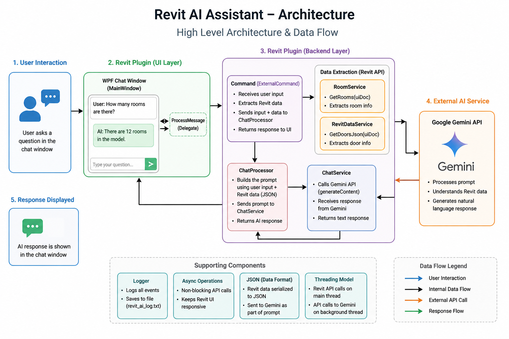

#  Revit AI Assistant (Gemini-Powered)

A Revit plugin that integrates an AI chatbot directly into Autodesk Revit, enabling users to query building data (rooms, doors, etc.) using natural language.

---

# Features

* 🔹 Chat-based interaction inside Revit
* 🔹 Extracts live model data (Rooms, Doors)
* 🔹 Uses Google Gemini for natural language responses
* 🔹 Non-blocking UI (no Revit freezing)
* 🔹 Logging for debugging and monitoring

---

#  Architecture


```
User (Chat UI)
      ↓
MainWindow (WPF)
      ↓ (delegate → async call)
Command (Revit Entry Point)
      ↓
ExternalEvent.Raise()   (Thread Bridge Trigger)
      ↓
RevitEventHandler.Execute()   (Runs on Revit MAIN thread)
      ↓
RoomService / DoorService     (Revit API data extraction)
      ↓
Structured JSON Data
      ↓
ChatProcessor                
      ↓
ChatService (Gemini API)   
      ↓
AI Response
      ↓
MainWindow (UI Update)
```

---

# Project Structure

```
ClassLibrary3 (Revit Plugin)
│
├── App.cs                 → Ribbon button setup
├── Command.cs             → Entry point + wiring
├── ChatProcessor.cs       → Prompt construction
├── ChatService.cs         → Gemini API call
├── RoomService.cs         → Room extraction
├── RevitDataService.cs    → Door extraction
├── Logger.cs              → Debug logs
│
ChatUI (WPF)
│
├── MainWindow.xaml        → Chat UI layout
├── MainWindow.xaml.cs     → UI logic
```

---

# Setup Instructions

## 1. Clone the Repository

```
git clone <your-repo-url>
```

---

## 2. Open in Visual Studio

* Open solution file
* Ensure both projects are loaded:

  * `ClassLibrary3`
  * `ChatUI`

---

## 3. Configure Revit References

Add references:

```
RevitAPI.dll
RevitAPIUI.dll
```

From:

```
C:\Program Files\Autodesk\Revit 2027\
```

---

## 4. Install NuGet Packages

```
Newtonsoft.Json
```

---

## 5. Configure Gemini API

### Set API Key

Replace in `ChatService.cs`:

```csharp
private static string apiKey = "YOUR_GEMINI_API_KEY";
```

OR (recommended):

Set environment variable:

```
GOOGLE_API_KEY=your_key
```

---

## 6. Build the Project

```
Build → Rebuild Solution
```

---

## 7. Deploy Add-in

Create `.addin` file:

```
C:\ProgramData\Autodesk\Revit\Addins\2027\
```

Example:

```xml
<RevitAddIns>
  <AddIn Type="Application">
    <Name>RevitAI</Name>
    <Assembly>C:\path\to\ClassLibrary3.dll</Assembly>
    <AddInId>YOUR-GUID</AddInId>
    <FullClassName>ClassLibrary3.App</FullClassName>
    <VendorId>DEV</VendorId>
  </AddIn>
</RevitAddIns>
```

---

# How It Works

1. User opens Revit
2. Clicks **"AI Assistant"** button
3. Chat window opens
4. User asks a question:

```
"How many rooms are there?"
```

5. Plugin:

   * Extracts Revit data (Rooms/Doors)
   * Sends data + question to Gemini
6. AI responds in natural language

---

# Example Flow

```
User Input:
"How many rooms are there?"

System:
→ Extract rooms from Revit
→ Convert to JSON
→ Send to Gemini

Gemini:
→ Processes data
→ Returns answer

Output:
"There are 12 rooms in the model."
```

---

# Logging

Logs are saved to:

```
Desktop/revit_ai_log.txt
```

Use logs to debug:

* API issues
* Data extraction issues
* Prompt validation

---

# Current Limitations

* Uses keyword-based detection:

  * `"room"` → RoomService
  * `"door"` → DoorService

* Sends full JSON to LLM (not scalable)

---

# Future Improvements

*  Dynamic tool-calling (LLM decides what to fetch)
*  Level-based filtering (Level 1, Level 2)
*  Highlight elements in Revit
*  Table-based UI (like Autodesk Assistant)
*  Streaming responses
*  Better intent detection

---

#  Key Design Principles

*  UI does NOT call Revit API directly
*  No blocking calls (`.Result`)
*  Async API calls
*  Delegate-based communication (no circular dependency)
*  Revit API only on main thread

---

# Troubleshooting

###  Chat not responding

* Check API key
* Check logs

###  No Revit data in response

* Ensure keyword matches ("room", "door")

###  Revit freezes

* Ensure no `.Result` or blocking calls

### API error

* Check internet
* Check Gemini API enabled

---

# Example Questions

* "How many rooms are there?"
* "List all doors"
* "Rooms with no windows"
* "What is the average room size?"

---


# Contribution

Feel free to improve:

* AI logic
* UI experience
* Revit integrations

---

# Next Step

To upgrade this into a **true AI assistant**:

Implement **LLM-based tool calling** instead of keyword detection

---
